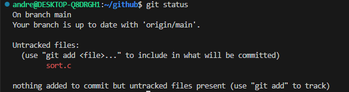
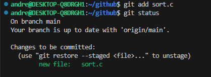
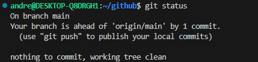
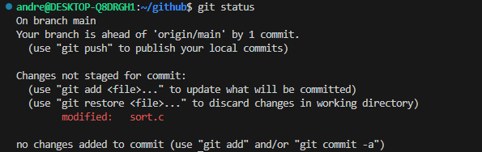
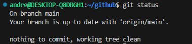
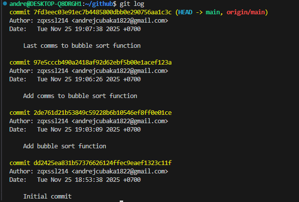

# Programming
## Лабораторная работа 9: Git

### На оценку 3

**1. Узнаем на какой ветке мы находимся**

Наш **git log** выглядит так:

**2. Создадим файл sort.c и вставим туда код функции bubble. Теперь наш **git status** выглядит так:**

**3. Закоммитим файл в репозиторий. Теперь git status:**

**4. После добавления комментария в файл наш git status принял вид:**

**5. Мы добавили наши изменение файла с помощью "add"**

**6. После повторного изменения файла и коммита:**

### Теперь работа с ветками
**1. Создадим новую ветку и убедимся в этом**

**Сейчас git status на двух ветках такой**

**2. Создадим файл с именем file1.txt и своим именем. Добавим файл и закоммитим его. Используем git log, чтобы увидеть,что наша ветка указывает на новый коммит.**

**3. Вернемся в ветку main и проверим git log здесь**

**4. Создадим новый файл с именем file2.txt и закоммитим его. Используем git log --oneline --graph --all, чтобы увидеть, что теперь у двух веток разные коммиты.**

**5. Переключившись на ветку mybranch мы не увидим нашего file2.txt**

С помощью git diff посмотрим разницу между ветками

