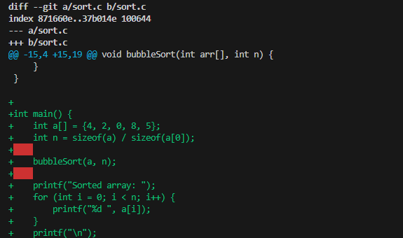
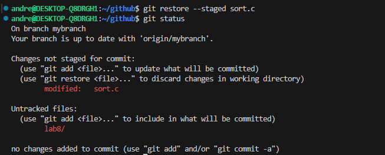
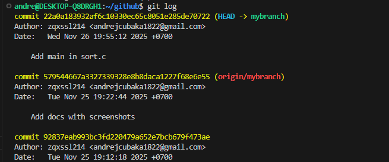
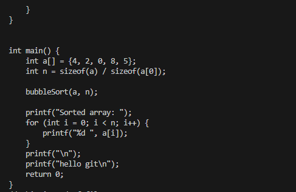
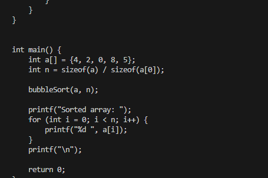
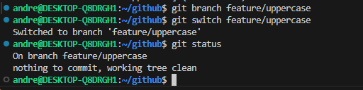
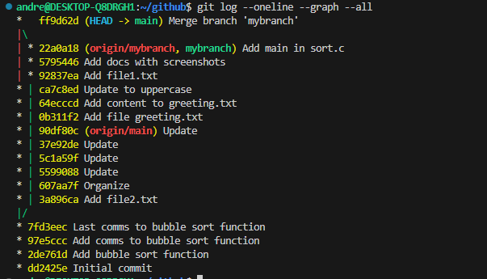
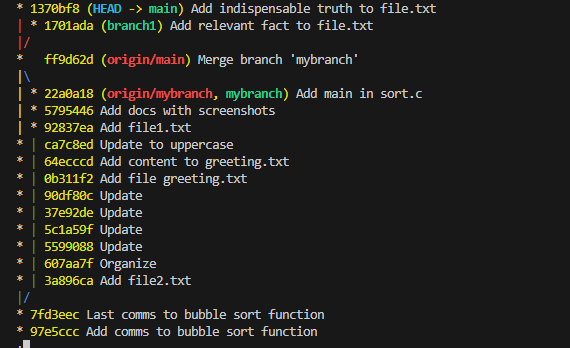

# ****Programming****
## **Лабораторная работа 9: Git**

## **На оценку 3**

**1. Узнаем на какой ветке мы находимся**

Наш **git log** выглядит так:

**2. Создадим файл sort.c и вставим туда код функции bubble. Теперь наш **git status** выглядит так:**

**3. Закоммитим файл в репозиторий. Теперь git status:**

**4. После добавления комментария в файл наш git status принял вид:**

**5. Мы добавили наши изменение файла с помощью "add"**

**6. После повторного изменения файла и коммита:**

### Теперь работа с ветками
**1. Создадим новую ветку и убедимся в этом**

**Сейчас git status на двух ветках такой**

**2. Создадим файл с именем file1.txt и своим именем. Добавим файл и закоммитим его. Используем git log, чтобы увидеть,что наша ветка указывает на новый коммит.**

**3. Вернемся в ветку main и проверим git log здесь**

**4. Создадим новый файл с именем file2.txt и закоммитим его. Используем git log --oneline --graph --all, чтобы увидеть, что теперь у двух веток разные коммиты.**

**5. Переключившись на ветку mybranch мы не увидим нашего file2.txt**

С помощью git diff посмотрим разницу между ветками

## **На оценку 4**

**Выполнив первые пункты. git diff показывает нам следующее**

Но git diff --staged пустой.

После того как мы проиндексировали sort.c git diff:

А вот git diff --staged уже не пустой

Это говорит нам о том, что git diff показывает изменения в рабочей директории (те, которые мы не проиндексировали)
git diff --staged показывает изменения уже проиндексированные

Наш git status

Запустив git restore --staged sort.c наш git status стал таким

После индексации файла наш журнал выглядит так:

Мы добавили новую строчку в sort.c. Его содержимое:

После git restore содержимое sort.c такое:

### **Работа с ветками**

Проделав пункты 1-4 наш git status выглядит так:

Отредактировав файл greeting.txt git branch и git log такие:

Переключивишись на main сравним ветки

Засмержим ветки

Содержимое greetings.txt

Засмержим mybranch в main 

##  **На оценку 5**

Выполнив пункты 1-5 мы получаем такой git log

Засмержив ветку branch1 в main получаем конфликт. git status такой

Исправив данный конфликт (объединили) и закоммиттив это git log :

**Починим Merge конфликты для сортировки MergeSort на python.**

Выполнив пункты 1-7 мы получим такой git log :

Получаем такой git branch из 4 веток

Смержим Mergesort-Impl в main и исправляем все конфликты (объединяя)

😎 Пушим изменения 😎

✔ Готово ✔

