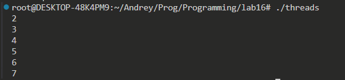
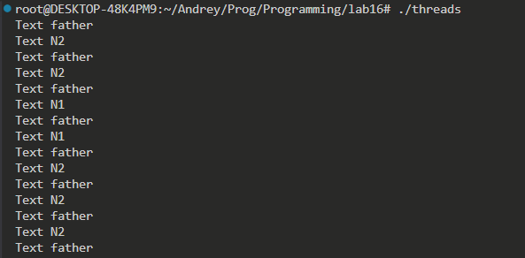
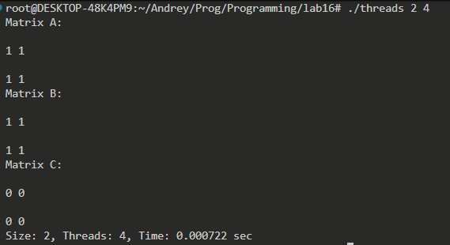
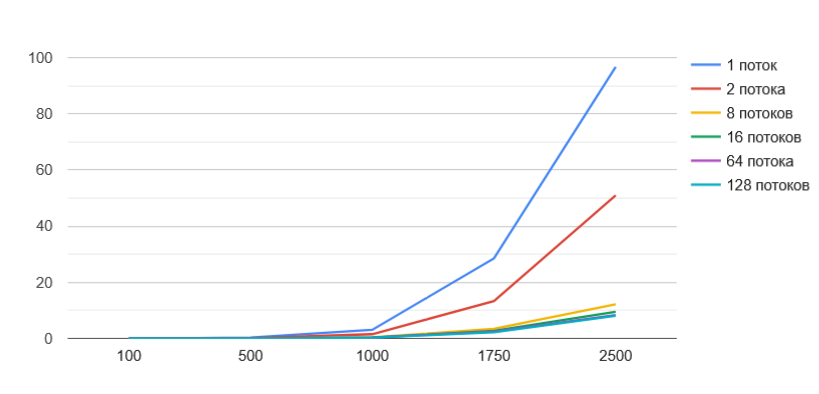

# ****Небольшой отчет по практической №6.****
## **На оценку 3. Знакомство с phtread**
### **Пункт 6. SleepSort**

## **На оценку 4.**
### **Пункт 7. Сихнхронизированный вывод**

### **Пункт 8 (a, b). Перемножение матриц**

### **Пункт 9. Время выполнения**

